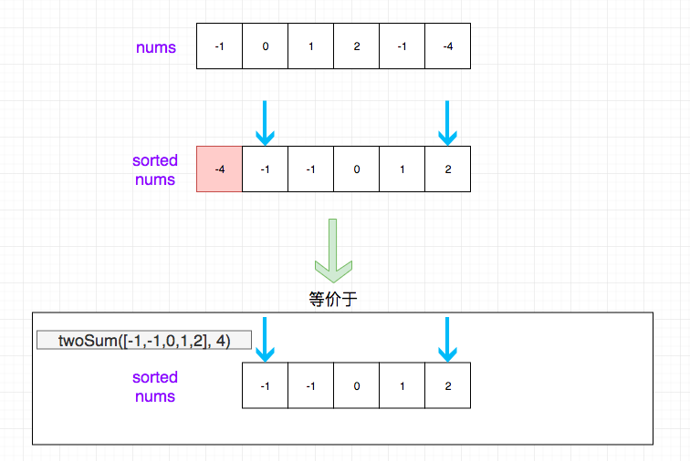

## 题目地址
https://leetcode.com/problems/3sum/description/

## 题目描述
```
Given an array nums of n integers, are there elements a, b, c in nums such that a + b + c = 0? Find all unique triplets in the array which gives the sum of zero.

Note:

The solution set must not contain duplicate triplets.

Example:

Given array nums = [-1, 0, 1, 2, -1, -4],

A solution set is:
[
  [-1, 0, 1],
  [-1, -1, 2]
]

```
## 思路

我们采用`分治`的思想. 想要找出三个数相加等于0，我们可以数组依次遍历，
每一项a[i]我们都认为它是最终能够用组成0中的一个数字，那么我们的目标就是找到
剩下的元素（除a[i]）`两个`相加等于-a[i].

通过上面的思路，我们的问题转化为了`给定一个数组，找出其中两个相加等于给定值`，
这个问题是比较简单的， 我们只需要对数组进行排序，然后双指针解决即可。 加上我们需要外层遍历依次数组，因此总的时间复杂度应该是O(N^2)。

思路如图所示：



> 在这里之所以要排序解决是因为， 我们算法的瓶颈在这里不在于排序，而在于O(N^2)，如果我们瓶颈是排序，就可以考虑别的方式了


> 如果找某一个特定元素，一个指针就够了。如果是找两个元素满足一定关系（比如求和等于特定值），需要双指针，
当然前提是数组有序。
## 关键点解析

- 排序之后，用双指针
- 分治

## 代码
```js

/*
 * @lc app=leetcode id=15 lang=javascript
 *
 * [15] 3Sum
 *
 * https://leetcode.com/problems/3sum/description/
 *
 * algorithms
 * Medium (23.51%)
 * Total Accepted:    531.5K
 * Total Submissions: 2.2M
 * Testcase Example:  '[-1,0,1,2,-1,-4]'
 *
 * Given an array nums of n integers, are there elements a, b, c in nums such
 * that a + b + c = 0? Find all unique triplets in the array which gives the
 * sum of zero.
 *
 * Note:
 *
 * The solution set must not contain duplicate triplets.
 *
 * Example:
 *
 *
 * Given array nums = [-1, 0, 1, 2, -1, -4],
 *
 * A solution set is:
 * [
 * ⁠ [-1, 0, 1],
 * ⁠ [-1, -1, 2]
 * ]
 *
 *
 */
/**
 * @param {number[]} nums
 * @return {number[][]}
 */
var threeSum = function(nums) {
  if (nums.length < 3) return [];
  const list = [];
  nums.sort((a, b) => a - b);
  for (let i = 0; i < nums.length; i++) {
    // skip duplicated result without set
    if (i > 0 && nums[i] === nums[i - 1]) continue;
    let left = i;
    let right = nums.length - 1;
   
    // for each index i
    // we want to find the triplet [i, left, right] which sum to 0
    while (left < right) {
      // skip i === left or i === right, in that case, the index i will be used twice
      if (left === i) {
        left++;
      } else if (right === i) {
        right--;
      } else if (nums[left] + nums[right] + nums[i] === 0) {
        list.push([nums[left], nums[right], nums[i]]);
        // skip duplicated result without set
        while(nums[left] === nums[left + 1]) {
            left++;
        }
        left++;
        // skip duplicated result without set
        while(nums[right] === nums[right - 1]) {
            right--;
        }
        right--;
        continue;
      } else if (nums[left] + nums[right] + nums[i] > 0) {
        right--;
      } else {
        left++;
      }
    }
  }
  return list;
};
```
